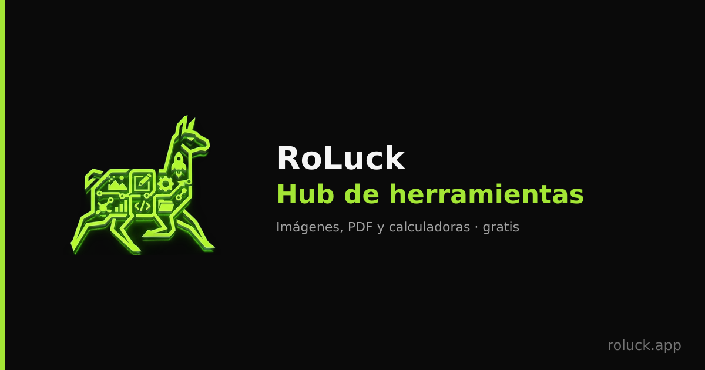

<div align="center">



# RoLuck Convertidor

**Convierte, edita y crea imágenes — 100% en tu navegador.**

Sin servidores · sin subidas · sin límites · sin cuentas.

[](https://react.dev)
[](https://www.typescriptlang.org/)
[](https://vitejs.dev)
[](https://tailwindcss.com)
[](#-extras-a-nivel-app)

</div>

---

## ✨ ¿Qué es?

RoLuck Convertidor es un **hub de herramientas de imagen** que funciona por completo del
lado del cliente. Todo el procesamiento ocurre en tu dispositivo con la **Canvas API**,
**códecs WASM** y modelos de **IA en el navegador** — ninguna imagen sale de tu equipo.

> Estética *dark tech*: fondo casi negro, acento verde lima y tipografía monoespaciada
> para los valores numéricos. 🦙

---

## 🧰 Las 8 categorías

| | Categoría | Qué hace |
|---|---|---|
| 🔄 | **Convertir** | Entre PNG, JPEG, WebP y **AVIF**. También abre HEIC/HEIF. |
| 🗜️ | **Comprimir** | Reduce el peso o apunta a un **tamaño objetivo en KB**. |
| ✏️ | **Editor** | Recortar, rotar, voltear, filtros, marca de agua y **quitar fondo** (IA). |
| 📐 | **Redimensionar** | Por píxeles o con **presets de redes**, y genera `srcset`. |
| 📦 | **Lote + ZIP** | Procesa muchas imágenes a la vez y descarga todo en un `.zip`. |
| 📄 | **A PDF** | Combina imágenes en un PDF multipágina, reordenable. |
| 🎨 | **Crear** | GIF animado, spritesheet + CSS, collage y dividir en cuadrícula. |
| 🛠️ | **Herramientas** | Favicon `.ico`, Base64/Data URI, paleta de colores, visor EXIF y **OCR**. |

**Privacidad por diseño:** como cada conversión redibuja la imagen en un canvas, se
**eliminan los metadatos EXIF** (geolocalización, datos de cámara) automáticamente.

---

## 🚀 Extras a nivel app

- 📲 **PWA instalable** — funciona offline tras la primera carga (service worker propio).
- 🌐 **i18n ES / EN** — solución propia, sin librería, con detección automática.
- ⭐ **Presets guardados** — guarda tus combinaciones de formato/calidad favoritas.
- 🕘 **Historial de sesión** — re-descarga resultados recientes sin reconvertir.
- 📋 **Pegar del portapapeles** — `Ctrl/Cmd + V` para cargar una imagen al instante.
- 🔎 **SEO técnico** — meta por ruta, **prerender** estático por página y `FAQPage` JSON-LD.
- 📊 **Analítica opcional** — [Umami](https://umami.is) auto-hospedado, sin cookies (opt-in).

---

## 🧩 Stack

- **React 18 + TypeScript** · **Vite** · **Tailwind CSS v3**
- **React Router** (hub multipágina) · **Zustand** (estado: pila de edición + cola)
- Sin backend, sin API externa, sin librerías de UI (iconos: `@tabler/icons-react`)

### Dependencias pesadas (todas *lazy*)

| Librería | Para qué |
|---|---|
| `@jsquash/avif` | Codificar/decodificar AVIF (WASM) |
| `heic2any` | Decodificar HEIC/HEIF (fotos de iPhone) |
| `@imgly/background-removal` | Quitar fondo con modelo de IA |
| `tesseract.js` | OCR (reconocimiento de texto) |
| `jszip` · `jspdf` · `pdfjs-dist` | ZIP, PDF y render de PDF |
| `gif.js` · `react-image-crop` | GIF animado y recorte |

> El *lazy loading* mantiene el bundle inicial liviano: estas librerías solo se descargan
> cuando realmente usas esa función.

---

## 📁 Estructura

```
src/
├── App.tsx                 # Router con las 8 rutas (lazy)
├── main.tsx                # Entrada: I18nProvider, SW, analítica
├── pages/                  # Una página por categoría
├── components/             # UI compartida (+ create/ y tools/)
│   └── RailLayout.tsx      # Riel lateral persistente + logo
├── store/                  # Zustand: app, presets, historial
├── hooks/                  # Conversión, lote, target size, PDF, quitar fondo…
├── utils/                  # canvas, AVIF, HEIC, GIF, favicon, EXIF, OCR…
├── i18n/                   # Diccionario ES/EN + contexto
├── seo/                    # Meta por ruta, hook useSeo, contenido on-page
└── types/

public/                     # Assets de marca, manifest, sw.js, robots, sitemap
brand/logo-master.png       # Logo master (fuente de los assets de marca)
scripts/
├── gen-brand.cjs           # Genera logo/favicons/PWA/OG desde el master
└── prerender.cjs           # Prerender SEO por ruta (post-build)
deploy/                     # nginx.conf, deploy.sh y guía de despliegue
```

---

## 🛠️ Desarrollo

Requisitos: **Node 18+**.

```bash
npm install      # instalar dependencias
npm run dev      # servidor de desarrollo → http://localhost:5173
npm run build    # build de producción + prerender SEO → /dist
npm run preview  # previsualizar el build
```

### Regenerar los assets de marca

El logo, favicons, iconos PWA y la imagen OG se generan desde `brand/logo-master.png`.
`sharp` se usa solo de forma puntual (no es dependencia del proyecto):

```bash
npm i -D sharp && npm run gen:brand && npm rm sharp
```

---

## 🌍 Deploy

Los artefactos están en [`deploy/`](deploy/):

- **`nginx.conf`** — SPA + prerender (`try_files $uri $uri.html …`), MIME de `.wasm`/
  `.webmanifest`, caché de assets con hash y `sw.js` sin caché.
- **`deploy.sh`** — `build` + `rsync --delete` al VPS.
- **`DEPLOY.md`** — guía paso a paso (incluye Umami con Docker).

```bash
# 1. Configura tu dominio y (opcional) Umami
cp .env.example .env   # edita VITE_SITE_URL y, si aplica, las vars de Umami

# 2. Construye y despliega
bash deploy/deploy.sh

# 3. SSL
sudo certbot --nginx -d roluck.app
```

---

## 📝 Notas

- **Siempre dark** — no hay tema claro.
- **AVIF vía WASM** — más consistente entre navegadores que `canvas.toBlob`.
- **Offline** — tras la primera carga la app funciona sin conexión (salvo la descarga
  inicial del modelo de quitar fondo).

---

<div align="center">

Hecho con 🦙 y verde lima · **[roluck.app](https://roluck.app)**

</div>
